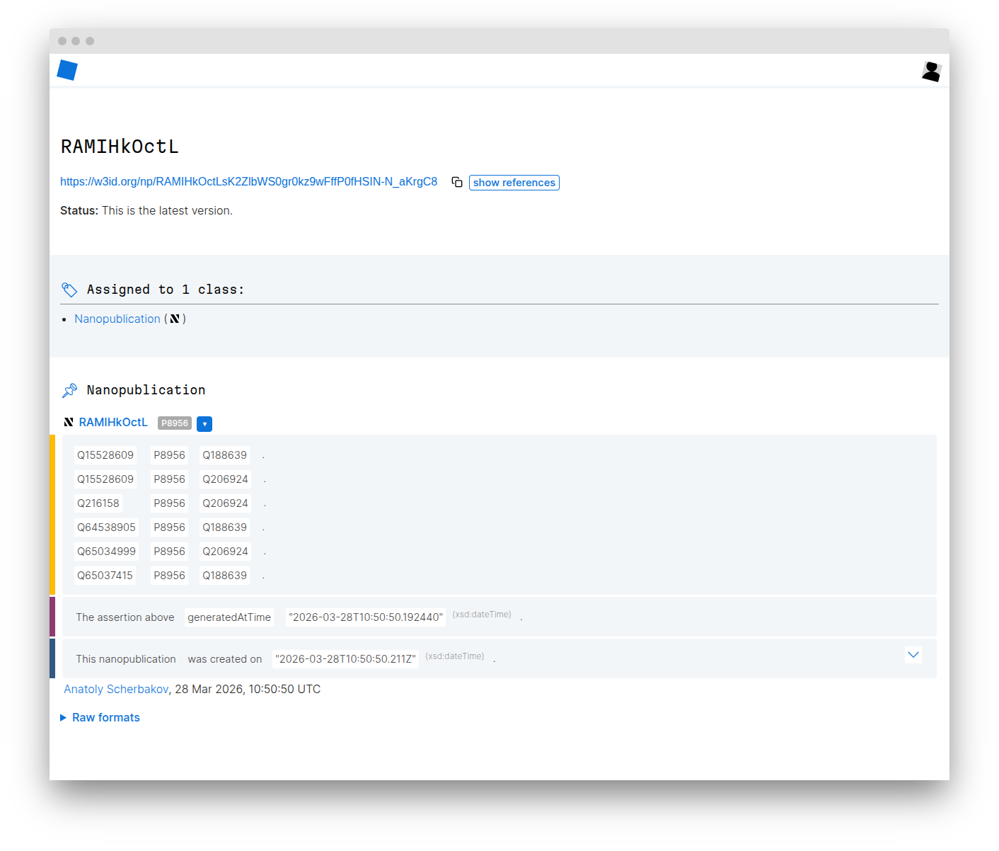

# nanopublishing <small>with coding agents and <code>iolanta</code></small>

## Installation

Install all skills from this repository into the current project for your agent of choice:

```bash title="Install"
npx skills add https://github.com/iolanta-tech/nanopublishing --skill '*' -a claude-code # (1)!
```

1. Some valid agent values include: `claude-code`, `codex`, `cursor`, and [others](https://github.com/vercel-labs/skills#supported-agents).

Add <code>-g</code> if you want a global install instead of a project-local one.

## Example session

=== ":simple-claude: Claude Code"

    ```bash
    claude
    ```

=== ":fontawesome-brands-openai: Codex"

    ```bash
    codex --full-auto # (1)!
    ```

    1. Codex needs `--full-auto` here to permit access to cache directories.

=== ":simple-cursor: Cursor"

    ```bash
    cursor-agent # (1)!
    ```

    1. Or just use chat in Cursor IDE.


<div class="session-step" markdown="1">
<div markdown="1">
<div class="chat-block user">
  <div class="chat-speaker"><span>Dave</span></div>
  Please write, in <code>index.md</code>, that Europa is a satellite of Jupiter, according to the International Astronomical Union.
</div>
<div class="chat-block agent">
  <div class="chat-speaker"><span>HAL 9000</span></div>
  Here you are.
</div>
</div>
<div markdown="1">

```markdown title="index.md"
--8<-- "examples/odyssey-2001/europa-is-a-satellite-of-jupiter/index.md:22:26"
```

</div>
</div>

<div class="session-step chat-only" markdown="1">
<div markdown="1">

<div class="chat-block user">
  <div class="chat-speaker"><span>Dave</span></div>
  How do we express that one thing is a satellite of another? <strong>/find-url-for</strong>&nbsp;<em>satellite of</em>
</div>
<div class="chat-block agent" markdown="1">
  <div class="chat-speaker"><span>HAL 9000</span></div>
  Wikidata has [ :fontawesome-brands-wikipedia-w: <code>wdt:P397</code> ](https://www.wikidata.org/wiki/Property:P397), but for readability we can mint a local predicate and declare it as a subproperty.
</div>

</div>
</div>

<div class="session-step" markdown="1">
<div markdown="1">

<div class="chat-block user">
  <div class="chat-speaker"><span>Dave</span></div>
  Okay, let's rely upon wikidata. <strong>/semantify</strong> <code>index.md</code>, then.
</div>
<div class="chat-block agent" markdown="1">
  <div class="chat-speaker"><span>HAL 9000</span></div>
  I've added [ :simple-yaml: YAML-LD ](https://w3c.github.io/yaml-ld/spec/) frontmatter and mapped the astronomy claim to linked data.
</div>

</div>
<div markdown="1">

```markdown
--8<-- "examples/odyssey-2001/europa-is-a-satellite-of-jupiter/index.md:1:26"
```

</div>
</div>

<div class="session-step" markdown="1">
<div markdown="1">

<div class="chat-block user">
  <div class="chat-speaker"><span>Dave</span></div>
  Okay, that looks fine. <strong>/nanopublish</strong> <code>index.md</code>.
</div>
<div class="chat-block agent">
  <div class="chat-speaker"><span>HAL 9000</span></div>
  It is published. The signed artifact remains beside the Markdown source.
</div>

</div>
<div markdown="1">

[{ .publish-preview }](https://w3id.org/np/RAQtNxM5sbzt7-4lGVzAMPQtT32wDUGJAqKJObwdbYNDs)

</div>
<div class="session-breakout" markdown="1">

### Visualization

```mermaid
{{ ('https://w3id.org/np/RAQtNxM5sbzt7-4lGVzAMPQtT32wDUGJAqKJObwdbYNDs') | as('mermaid') }}
```

[See the full example](examples/odyssey-2001/europa-is-a-satellite-of-jupiter/index.md){ .md-button }

</div>
</div>

<p class="avatar-attribution">
  HAL 9000 avatar: <a href="https://commons.wikimedia.org/wiki/File:HAL9000_-_Sharper_Reflections.svg">“HAL9000 - Sharper Reflections.svg”</a> by Cryteria and MorningLemon, licensed under <a href="https://creativecommons.org/licenses/by/3.0/">CC BY 3.0</a>, via Wikimedia Commons.
</p>

<style>
.site-subtitle {
  margin-top: -0.8rem;
  font-size: 1.15rem;
  color: var(--md-default-fg-color--light);
}

.session-step {
  display: grid;
  gap: 1.2rem;
  margin: 1.8rem 0 2.2rem;
  align-items: start;
}

.session-breakout {
  grid-column: 1 / -1;
}

.chat-block {
  display: inline-block;
  width: fit-content;
  max-width: 100%;
  margin: 1rem 0 0.6rem;
  padding: 0.75rem 0.95rem;
  border: 1px solid var(--md-default-fg-color--lightest);
  border-radius: 0.9rem;
  background: rgba(255, 255, 255, 0.03);
  font-family: var(--md-code-font);
  font-size: 0.95rem;
}

.chat-speaker {
  display: flex;
  align-items: center;
  gap: 0.65rem;
  margin-bottom: 0.7rem;
  font-family: var(--md-text-font);
  font-size: 0.78rem;
  font-weight: 700;
  letter-spacing: 0.08em;
  text-transform: uppercase;
}

.chat-avatar {
  flex: none;
  display: inline-block;
  width: 1.1rem;
  height: 1.1rem;
  object-fit: cover;
}

.dave-avatar {
}

.hal-avatar {
}

.avatar-attribution {
  margin-top: -0.4rem;
  margin-bottom: 2rem;
  font-size: 0.72rem;
  color: var(--md-default-fg-color--light);
}

.publish-preview {
  display: block;
  width: 100%;
  border-radius: 0.9rem;
}

.chat-block.user {
  display: table;
  margin-right: 12%;
  color: var(--md-accent-fg-color);
}

.chat-block.agent {
  display: table;
  margin-left: auto;
  margin-right: 0;
  color: var(--md-default-fg-color--light);
  background: rgba(255, 255, 255, 0.05);
  text-align: right;
}

.chat-block.agent .chat-speaker {
  justify-content: flex-end;
}

@media screen and (min-width: 76.25em) {
  .session-step {
    grid-template-columns: minmax(0, 0.95fr) minmax(0, 1.35fr);
  }

  .session-step.chat-only {
    grid-template-columns: minmax(0, 0.95fr);
  }
}
</style>
